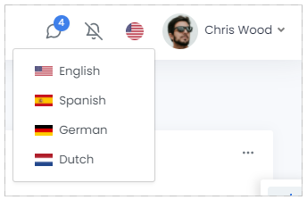

# UI Framework 공통 기능 설계서
<br>
<center> R&D team </center>
<center> yoon, lee </center>   
<br><br>   
<center> copyright@ FormationLabs </center>   
<br>   

---

## Index
<br>

### [LogIn](#Design-LogIn)
### [LogOut]()
### [Factory Change]()
### [Localization]()
---

### **Design LogIn**
> MOM 로그인 정보의 유지는 Browser 단위로 정보가 저장되는 Local storage를 사용한다.   
> Browser Tab을 추가하거나 재 시작할 경우, 로그인 필요 없음
### Detail Design

1. ### Logic Flow Design
   ```mermaid
    graph TB
        subgraph Service
        b1{b1.계정존재확인}-->|Yes| b2{b2.계정잠김확인}
        b2-->|No| b3{b3.비밀번호확인}
        b3-->|No|b4[b4.LogIn Retry 카운트 증가]
        b3-->|Yes|b5[b5.LogIn 처리]
        b5-->b6[b6.권한있는 메뉴 리스트 반환]
        end
        subgraph UI
        a1[a1.로그인클릭]-->a2[a2.로그인PC 정보 수집]
        a2-->a3[a3.비밀번호 암호화]
        a3-->a4[a4.로그인 요청]
        a5[a5.로그인실패]
        a6[a6.계정 정보 및 비밀번호 저장]
        a6-->a7[a7.메뉴 구성]
        end
        a4--msg-login-->b1
        b1 --No <br/> msg-loginfail--> a5
        b2--Yes <br/> msg-loginfail--> a5
        b5--msg-loginfail-->a5
        b6--msg-loginsuccess-->a6
    ```
    |Activity|Reference|Description|
    |-|-|-|
    |a1.로그인클릭||UI에서 로그인 정보 입력 후 로그인 버튼 클릭|
    |a2.로그인PC 정보 수집||IP, MAC, HOST, UI version, Login System|
    |a3.비밀번호 암호화||sha-256 type으로 암호화 처리|
    |a4.로그인요청|[msg-login](#msg-login)|Service로 로그인 처리 요청|
    |a5.로그인실패|[로그인 실패 코드](./공통%20코드%20정의.md)|로그인 실패 처리|
    |a6.계정 정보 및 비밀번호 저장||Local Session에 계정 정보 저장|
    |a7.메뉴 구성||응답받은 |
    |b1.계정 존재 확인||
    |b2.계정 잠김 확인||
    |b3.비밀번호 확인||
    |b4.LogIn Retry 카운트 증가||
	|b5.LogIn 처리||    
    |b6.권한있는 메뉴 리스트 반환||
2. ### UI UX Design
    
    - 선택된 언어의 국기 표시
    - 클릭했을 경우 선택할 수 있는 언어와 해당 국기 표시
    - 선택 시, 선택한 언어 Data 요청 및 변경
3. ### UI Class Design
    ``` mermaid
    classDiagram
        ILocalization <|.. FLLabel
        ILocalization <|.. FLGrid
        ILocalization <|.. FLButton
        ILocalization <|.. FLMenu
        ILocalization <|.. FLDropDown
        FLLabel <.. LanguageService
        FLGrid <.. LanguageService
        FLButton <.. LanguageService
        FLMenu <.. LanguageService
        FLDropDown <.. LanguageService
        class ILocalization
        ILocalization : +string key
        ILocalization : +string DisplayName
        ILocalization : +GetDisplayName(string language, string key)
        class FLLabel
        class FLGrid
        class FLButton
        class FLMenu
        class FLDropDown
        class LanguageService
        LanguageService : +FindDisplayName(stringt factoryId, string language,string key)
        LanguageService : +SaveLanguageToCookie
    ```
4. ### Message Design
    - common header
    ```json
    {
        "Header" : {
            "MessageName" : "ChangeLanguage",
            "CommunicationType" : "Request",
            "SiteId" : "", //선택한 Site Id
            "UserId" : "", //입력한 User Id
            "SourceSystem" : "MOM",
            "TargetSystem" : "OIX",
            "SourceUrl" : "0.0.0.0", //로컬 Ip 주소
            "TargetUrl" : "http://0.0.0.0:00/api/login",
            "SourceTopic" : "",
            "TargetTopic" : "OIX",
            "Tid" : "", //guid
            "TimeStamp" : "", //yyyy-MM-dd HH:mm:ss.fff
            "Language" : "", //선택한 Language Id
            "Encoding" : "", //default : null
            "SecretToken" : "" //jwt
        },
        "Body": [...],
        "Reply" : {...}
        }
    ```
    - ### msg-changeLanguage
    ```json
    {
        "Header" : {...},
        "Body": [
            {"Language" : "kr"}, // 선택한 언어                
            ],
        "Reply" : {...}
        }
    ```
    - ### msg-languageData
    ```json
    {
        "Header" : {...},
        "Body": [
            {"Language" : "kr"}, // 선택한 언어                
            {"LanguageData":[
                "FACTORY":"공장",
                "MATERIAL":"자재",
                ...
            ]},
            ],
        "Reply" : {"ISSUCCESS":"Y",
                    ....}
        }
    ```
5. ### Service Class Design
6. ### Query Design
7. ### Data Design

---

### **Design Subject B**

### Detail Design

1. ### Logic Flow Design
2. ### UI UX Design
3. ### UI Class Design
4. ### Message Design
5. ### Service Class Design
6. ### Query Design
7. ### Data Design