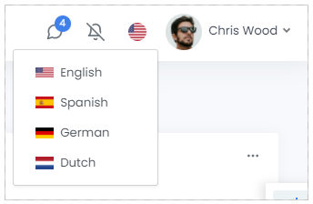

# Index
## [로그인](#로그인-기능-설계)
## [사이트변경]()
## [다국어](#다국어-기능-설계)

---

## 로그인 기능 설계
> MOM 로그인 정보의 유지는 아래와 같은 이유로 Browser 단위로 정보가 저장되는 Local storage를 사용한다. (Tab을 추가하거나 브라우저를 재 시작할 경우, 로그인 필요 없음)
- SSO 연동을 통한 로그인 정책
- ??

### 비즈니스 로직
  - Activity Diagram
    ::: mermaid
    graph TB
        subgraph Service
        b1[계정존재확인]-->b2{계정 존재?}
        b2-->|Yes| b3{계정잠김확인}
        b3-->|No| b4{비밀번호확인}
        b4-->|No|b5[LogIn Retry 카운트 증가]
        b4-->|Yes|b6[LogIn 처리]
        b6-->b7[권한있는 메뉴 리스트 반환]
        end
        subgraph UI
        a1[로그인클릭]-->a2[로그인PC 정보 수집]
        a2-->a3[비밀번호 암호화]
        a3-->a4[로그인 요청]
        a5[로그인실패]
        a6[계정 정보 및 비밀번호 저장]
        a6-->a7[메뉴 구성]
        end
        a4--msg-login-->b1
        b2 --No <br/> msg-loginfail--> a5
        b3--Yes <br/> msg-loginfail--> a5
        b5--msg-loginfail-->a5
        b7--msg-loginsuccess-->a6
    :::


### UI 설계
- **Design**   
    

- **설명**

    |항목|설명|컴포넌트|
    |-|-|-|-|
    |Id|사용자 Id (사번)|textbox|
    |Password|사용자 비밀번호|textbox|
    |Factory|사업장|dropdown|
    |Language|사용자 언어|dropdown|
       
 
- **Event**
 
    |순번|항목|설명|Message Id|UI Logic|
    |-|-|-|-|-|
    |1|Factory Binding|팩토리 코드 바인딩|[msg-factory](#msg-factory) |팩토리 코드 요청 및 바인딩|
    |2|Language Binding|시스템 언어 코드 바인딩|[msg-language](#msg-language)  |시스템 언어 코드 요청 및 바인딩|
    |3|Passwor Validation|비밀번호 유효성검증|  |입력한 비밀번호가 정책에 맞는지 즉시 검증|
    |4|Login Click|로그인 클릭 이벤트|[msg-login](#msg-login) |로그인 서비스 요청|

- **Message**
  1. common header
        ```json
        {
            "Header" : {
                "MessageName" : "LogIn",
                "CommunicationType" : "Request",
                "SiteId" : "", //선택한 Site Id
                "UserId" : "", //입력한 User Id
                "SourceSystem" : "MOM",
                "TargetSystem" : "OIX",
                "SourceUrl" : "0.0.0.0", //로컬 Ip 주소
                "TargetUrl" : "http://0.0.0.0:00/api/login",
                "SourceTopic" : "",
                "TargetTopic" : "OIX",
                "Tid" : "", //guid
                "TimeStamp" : "", //yyyy-MM-dd HH:mm:ss.fff
                "Language" : "", //선택한 Language Id
                "Encoding" : "", //default : null
                "SecretToken" : "" //jwt
            },
            "Body": [...],
            "Reply" : {...}
            }
        ```
  2. ### msg-factory
        ```json
        {
            "Header" : {
                "MessageName" : "ExecuteQuery",
                ...},
            "Body": [
                {"SqlId" : "GetFactoryCode"}, // 쿼리 Id
                {"SqlCondition":"Where Is Usable = 'Y'"} // Sql 조건문
                ],
            "Reply" : {...}
            }
        ```
  3. ### msg-language
        ```json
        {
            "Header" : {
                "MessageName" : "ExecuteQuery",
                ...},
            "Body": [
                {"SqlId" : "GetLanguageCode"}, // 쿼리 Id
                {"SqlCondition":"Where Is Usable = 'Y'"} // Sql 조건문
                ],
            "Reply" : {...}
            }
        ```
  4. ### msg-login
        ```json
        {
            "Header" : {...},
            "Body": [
                {"password" : "alksdfjeiwjaksdjf"}, //sha-256 type. 비밀번호
                {"macaddress":""}, // 맥어드레스            
                {"uiversion":"1.1.7"} // UI Version 정보
                ],
            "Reply" : {...}
            }
        ```

### Service 설계


- **비즈니스 로직 (Sequence Diagram)**
    ::: mermaid
    sequenceDiagram
        participant UI
        participant Controller
        participant Service
        UI->> Controller: Login 요청 메시지        
        Note right of Controller: Rational thoughts <br/>prevail!
        Controller-->> Service: CRUD
        Service->>Controller: Login 처리 결과
        Controller-->>UI: LogIn 응답 메시지
    :::

---
 

## 다국어 기능 설계
<br/>

> 다국어 지원 범위는 Syncfusion Blazor 컴포넌트 영역과 비 컴포넌트 영역으로 구분하여 적용한다.
1. 컴포넌트 영역
   - 컴포넌트에서 제공하는 Default Message 및 Label등의 이름 `(ex. Placeholder:"Choose Date"/"날짜를 선택하세요")`
   - Syncfusion에서 제공하는 resx 파일을 사용하여 다국어 처리한다. `(DB Data를 통하여 관리하기엔 Data의 양과 처리 영역이 너무 많음)`
2. 비 컴포넌트 영역
   - Label 등 컴포넌트가 아닌 Html Markup을 사용하여 디자인한 Element 등
   DB에 저장된 다국어 정보 + 번역 기능을 통해 다국어 처리한다.
<br/>

### **1. 컴포넌트 영역**

- **참고**   
  - [Syncfusion Localization 참고 링크](https://blazor.syncfusion.com/documentation/common/localization/)   
  - [Syncfusion Localization GitHub](https://github.com/syncfusion/blazor-locale)

### **2. 비 컴포넌트 영역**
### Logic Flow
- **Activity Diagram**
    ::: mermaid
    graph TB
        subgraph Service
        b1[b1.언어Data 조회]-->b2[b2.언어 Data 반환]
        end
        subgraph UI
        a1[a1.언어선택]-->a2[a2.언어Data 요청]
        a3[a3.Data 쿠키 저장] -->a4[a4.null Data 번역 api로 생성]
        end
        a2--msg-changeLanguage-->b1
        b2--msg-languageData-->a3              
    :::    

- **Message**
  1. common header
        ```json
        {
            "Header" : {
                "MessageName" : "ChangeLanguage",
                "CommunicationType" : "Request",
                "SiteId" : "", //선택한 Site Id
                "UserId" : "", //입력한 User Id
                "SourceSystem" : "MOM",
                "TargetSystem" : "OIX",
                "SourceUrl" : "0.0.0.0", //로컬 Ip 주소
                "TargetUrl" : "http://0.0.0.0:00/api/login",
                "SourceTopic" : "",
                "TargetTopic" : "OIX",
                "Tid" : "", //guid
                "TimeStamp" : "", //yyyy-MM-dd HH:mm:ss.fff
                "Language" : "", //선택한 Language Id
                "Encoding" : "", //default : null
                "SecretToken" : "" //jwt
            },
            "Body": [...],
            "Reply" : {...}
            }
        ```
  2. ### msg-changeLanguage
        ```json
        {
            "Header" : {...},
            "Body": [
                {"Language" : "kr"}, // 선택한 언어                
                ],
            "Reply" : {...}
            }
        ```
  2. ### msg-languageData
        ```json
        {
            "Header" : {...},
            "Body": [
                {"Language" : "kr"}, // 선택한 언어                
                {"LanguageData":[
                    "FACTORY":"공장",
                    "MATERIAL":"자재",
                    ...
                ]},
                ],
            "Reply" : {"ISSUCCESS":"Y",
                        ....}
            }
        ```

### UI 설계
- **Design**   
  
  - 선택된 언어의 국기 표시
  - 클릭했을 경우 선택할 수 있는 언어와 해당 국기 표시
- **Event**
    |순번|항목|설명|Message Id|UI Logic|
    |-|-|-|-|-|
    |1|언어 선택|선택한 언어로 변경|[msg-change-LanguageChange](#msg-changeLanguage) |언어변경 요청|

- **컴포넌트 설계**
    
    ::: mermaid
    classDiagram
        ILocalization <|.. FLLabel
        ILocalization <|.. FLGrid
        ILocalization <|.. FLButton
        ILocalization <|.. FLMenu
        ILocalization <|.. FLDropDown
        FLLabel <.. LanguageService
        FLGrid <.. LanguageService
        FLButton <.. LanguageService
        FLMenu <.. LanguageService
        FLDropDown <.. LanguageService
        class ILocalization
        ILocalization : +string key
        ILocalization : +string DisplayName
        ILocalization : +GetDisplayName(string language, string key)
        class FLLabel
        class FLGrid
        class FLButton
        class FLMenu
        class FLDropDown
        class LanguageService
        LanguageService : +GetDisplayName(stringt factoryId, string language,string key)
    :::

    |항목|설명|
    |-|-|
    |ILocalization|다국어 처리를 위한 속성 및 함수의 규약|
    |FL[컴포넌트]|사용자 공통 컴포넌트|
    |LanguageService|쿠키에 저장된 언어 Data에서 공통 컴포넌트 key에 해당하는 언어 data를 반환|
---