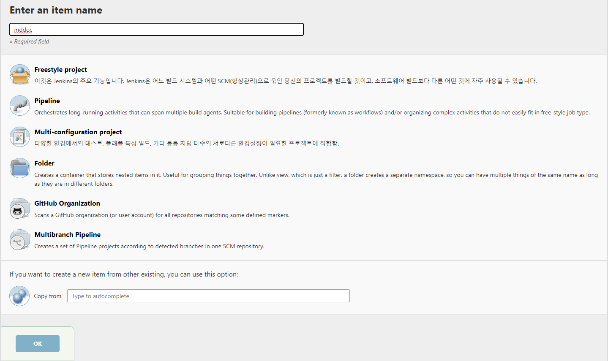
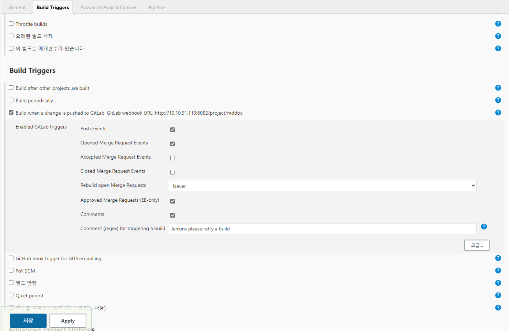
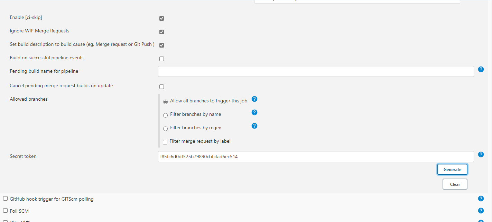
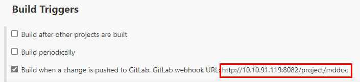
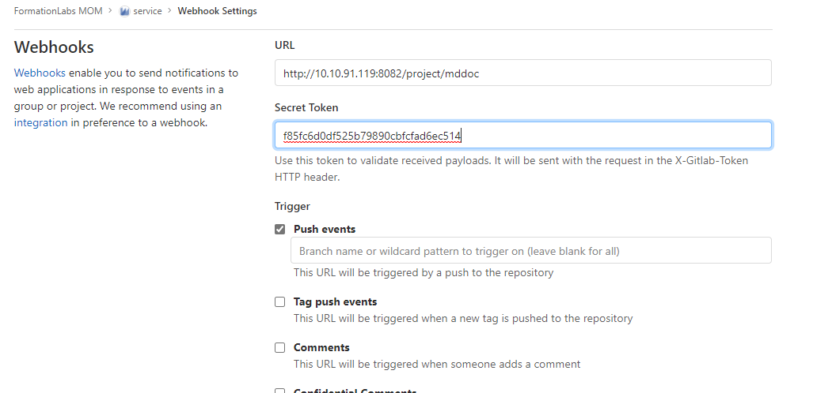

## CI 설정
> CI 설정하려는 소스에 Dockerfile이 추가되어 있어야 한다. (프로젝트 우클릭 > 추가 > Docker지원 선택하여 생성)

### Jenkins 
1. jenkins new item 생성
2. 구성 > Build Trigger > webhook 설정 선택
3. 구성 > Build Trigger > 고급 > secret token 발행
4. Pipeline 설정
   
    
    
    
    

### Gitlab
1. Webhook 등록
   1. Jenkins new item url      
      ``` 
      Jenkins > 구성 > Build Trigger > webhook 설정에서 보이는 url 복사
      ```
      

   2. Jenkins Secret token 입력
    